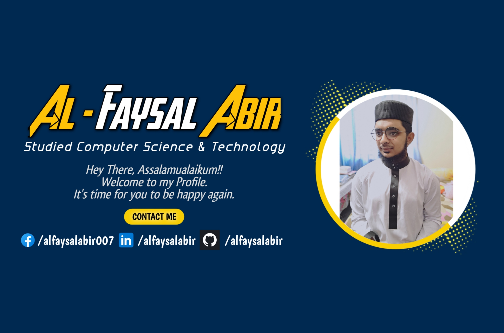

<!-- banner image starts here  -->

<!-- banner image ends here  -->

<h1> 👋 Assalamulaikum, I'm Al-Faysal Abir </h1>

Studied Computer Science & Technology (C.S.T)
 
 
🏠 &nbsp; Living: Mymensingh, Bangladesh

<!-- Contact me section starts here  -->

[][facebook]
[][linkedin]
 
 

<!-- Contact me section ends here  -->

<!-- about-me section starts here  -->

### 👨‍🏫 &nbsp; About Me

I am a Computer Science & Technology Student. I loved to do Programming Languages, Web Design & Development, and App Development. And I want to ba a Software Engineer. I practice Programming Language daily and I admitted to 1 Year Diploma Course in MERN Stack Development. Every day I want to learn something new knowledge of Programming Language and Improve my Programming Skill.

 
<!-- about-me section ends here  -->

<!-- education section starts here  -->

### 👨🏻‍🎓 &nbsp; Education

1. Diploma in Engineering Computer Science & Technology (C.S.T)  
   Rumdo Institue of Modern Technology (RIMT)  
   Mymensingh, Bangladesh.  
2. S.S.C in Humanities  
   Ideal International School & Collage  
   Mymensingh, Bangladesh.  
3. Special Certificet:  
   National Skill Standard Basic (360 Hrs) 6 Months Course in Computer Office Application  
   Bangladesh Technical Edecation Board (BTEB).  

 

<!-- education section ends here  -->

<!-- my languages section starts here  -->

### Languages:

- 🇧🇩 Bangla : Native
- 🏴󠁧󠁢󠁥󠁮󠁧󠁿 English : Fluent
- 🇮🇳 Hindi : Conversational
- 🇵🇰 Urdu : Conversational
   
   

<!-- my languages section ends here  -->

<!-- my sports and game section starts here  -->

### Sports / Games / Activities / Hobby:

- 🏏 Cricket, ⚽ Football, 🏸 Badminton
- 📲 Mobile Games, 🎮 PC Games
- 🏃‍♂️ Running, 🚶‍♂️ Walking
- 🖥️ Programming, 💻 Coding, ⚙️ Software Engineer, ✈️ Travelling

 
<!-- my sports and games section ends here  -->

---

Thanks for going through my Portfolio.
All rights reserved by Al-Faysal Abir @2025

---

<!-- Links section starts here -->

[facebook]: https://www.facebook.com/alfaysalabir007/
[linkedin]: https://www.linkedin.com/in/alfaysalabir/
[github]: https://github.com/alfaysalabir

<!-- Links section ends here -->
