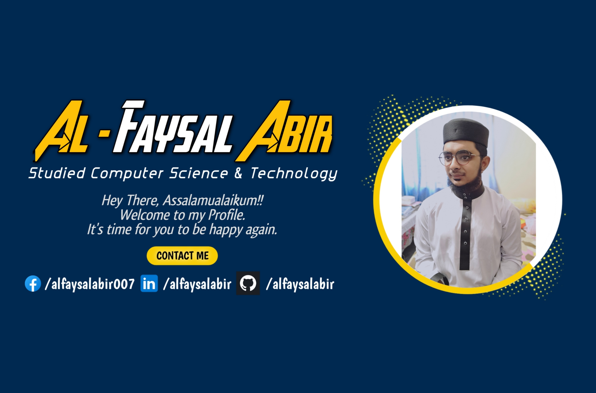

<!-- banner image starts here  -->

<!-- banner image ends here  -->

<h2> 👋 Assalamulaikum, 
🚀 I'm Al-Faysal Abir 
   🖥️ Full Stack Developer (MERN)
</h2>

Studied Computer Science & Technology (C.S.T)
 
 
🏠 &nbsp; Living: Mymensingh, Bangladesh

<!-- Contact me section starts here  -->

## 🌐 Contact me:
   
 
 

<!-- Contact me section ends here  -->

<!-- about-me section starts here  -->

## 👨‍🏫 &nbsp; About Me:

🔭 I’m currently working on:        🖥️ Full Stack Developer (MERN)  👯 I’m looking to collaborate on:       🧑‍💻 Software Engineering Team  🤝 I’m looking for help with:        🚀 Full Stack Development Project (MERN)  🌱 I’m currently learning:       ⚙️ Font-End & Back-End Development (MERN)  💬 Ask me about:       🏗️ MERN Stack Development  ⚡ Fun fact:       ⌨️ I use tabs over spaces  

I am a Computer Science & Technology Student. I loved to do Programming Languages, Web Design & Development, and App Development. And I want to ba a Software Engineer. I practice Programming Language daily and I admitted to 1 Year Diploma Course in MERN Stack Development. Every day I want to learn something new knowledge of Programming Language and Improve my Programming Skill.

 
<!-- about-me section ends here  -->

<!-- skills section ends here  -->

# 💻 Skills Stack:
                  

 
<!-- skills section ends here  -->

<!-- education section starts here  -->

## 👨🏻‍🎓 &nbsp; Education:

1. Diploma in Engineering Computer Science & Technology (C.S.T)  
   Rumdo Institue of Modern Technology (RIMT)  
   Mymensingh, Bangladesh.  
2. S.S.C in Humanities  
   Ideal International School & Collage  
   Mymensingh, Bangladesh.  
3. Special Certificet:  
   National Skill Standard Basic (360 Hrs) 6 Months Course in Computer Office Application  
   Bangladesh Technical Edecation Board (BTEB).
 

<!-- education section ends here  -->

<!-- my languages section starts here  -->

## 🗣️ Languages:

- 🇧🇩 Bangla : Native
- 🏴󠁧󠁢󠁥󠁮󠁧󠁿 English : Fluent
- 🇮🇳 Hindi : Conversational
- 🇵🇰 Urdu : Conversational
   
   

<!-- my languages section ends here  -->

<!-- github status section start here  -->

## 📊 GitHub Stats:
 
 

 
<!-- github status section end here  -->

<!-- my sports and game section starts here  -->

### Sports / Games / Activities / Hobby:

- 🏏 Cricket, ⚽ Football, 🏸 Badminton
- 📲 Mobile Games, 🎮 PC Games
- 🏃‍♂️ Running, 🚶‍♂️ Walking
- 🖥️ Programming, 💻 Coding, ⚙️ Software Engineer, ✈️ Travelling

 
<!-- my sports and games section ends here  -->

---

Thanks for going through my Portfolio.
All rights reserved by Al-Faysal Abir @2025

---
